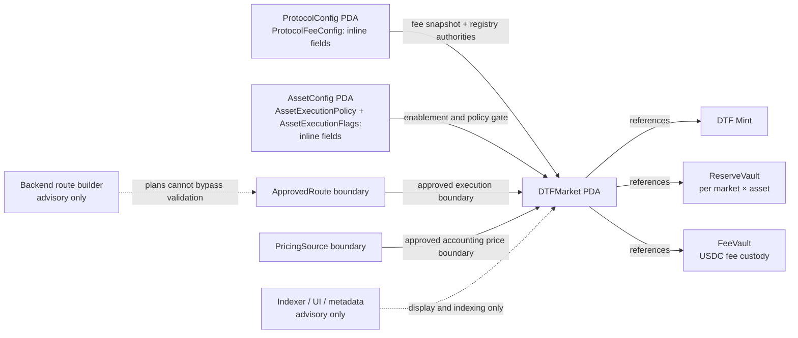
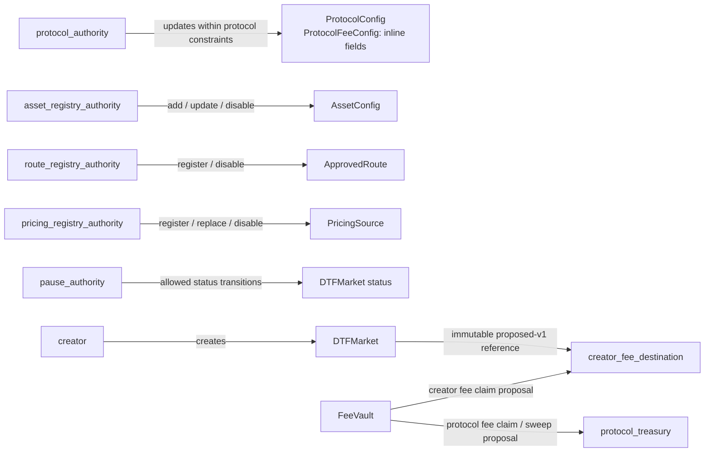
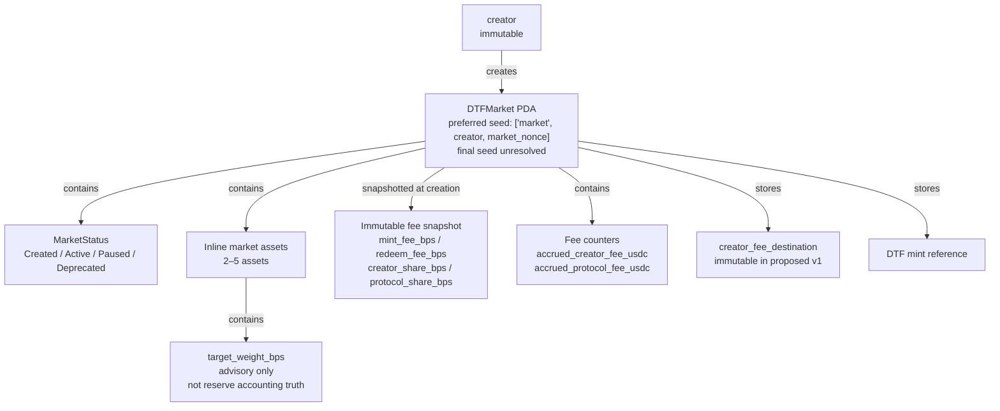
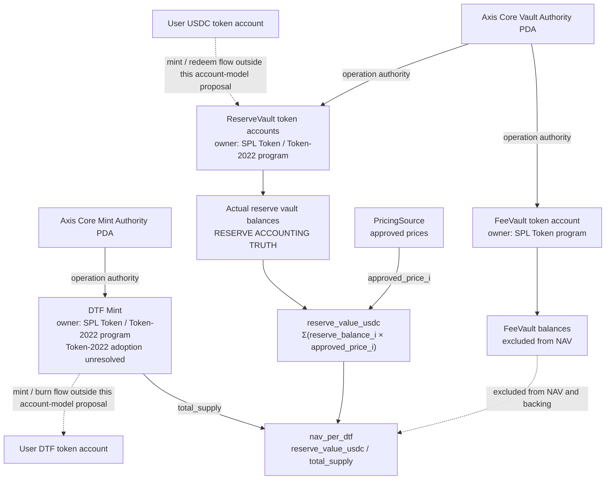
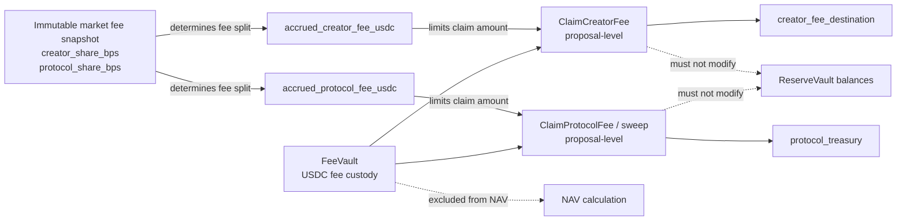
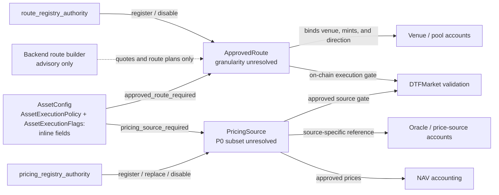
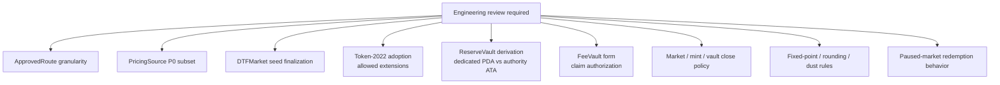

# Axis Core Account Model Proposal (P0-SPEC-04)

> Status: **proposal + minimal Rust scaffold source of truth**. This document does not finalize protocol behavior or serialization. Account layout, field widths, instruction account ordering, and final PDA seeds remain subject to engineering review (`requirements/19-axis-core-implementation-rfc.md` §11, §12).
>
> Source-of-truth rule: Axis_docs requirements are canonical. If existing contract code or legacy documentation conflicts with Axis_docs, Axis_docs takes precedence. Do not invent canonical fields. Keep undecided areas explicitly labeled as unresolved review questions.

---

## 1. Overview

Axis Core is the on-chain protocol layer for a reserve-backed DTF. At a high level, a user deposits USDC, approved execution converts it into underlying assets, the protocol holds those assets in controlled reserve vaults, and the user receives a DTF position token.

```text
USDC in
→ approved CPI execution
→ actual assets held in program-controlled reserve vaults
→ mint a DTF token, with Token-2022 as a candidate
→ burn the DTF token on redemption
→ unwind reserves
→ USDC out
```

This document explains how that product flow maps to Solana accounts. It starts with the account categories and relationships, then separates custody, accounting truth, authorities, reads, and write contention. Detailed requirement traceability remains available later in the document.

---

## 2. How to read this account model

This document models Axis Core as a Solana program, not as a relational database.

- Similar state categories are represented by the same account type. Each instance is a separate Solana account.
- An account address identifies one specific instance. When deterministic addressing is useful, the proposal describes a candidate or preferred PDA derivation.
- Relationships are represented by stored addresses, PDA seed relationships, or token-account authority relationships. They are not database joins.
- Token custody lives in accounts owned by the SPL Token or Token-2022 program. Axis Core operates those accounts through PDA authorities.
- Backend, indexer, UI, quote, and metadata systems can improve discovery and UX, but they are not protocol or accounting truth.

The narrative follows the account-modeling questions in Helius's [“How to Turn Your Idea into a Solana Program”](https://www.helius.dev/blog/how-to-turn-your-idea-into-a-solana-program-smart-contract). That article is a presentation and modeling reference only; Axis_docs requirements and the local scaffold remain the protocol source of truth.

---

## 3. Axis account-modeling flow

The review flow is intentionally ordered from basic state modeling to operational concerns.

### 3.1 Define the data as Solana accounts

Axis P0 uses a small set of account categories:

- Protocol-level configuration: `ProtocolConfig`
- Market-level state: `DTFMarket`
- Asset enablement and execution limits: `AssetConfig`
- Execution approval boundary: `ApprovedRoute`
- Accounting-price boundary: `PricingSource`
- Position token: DTF mint
- Reserve custody: `ReserveVault`
- Fee custody: `FeeVault`

`ProtocolFeeConfig` is inline in `ProtocolConfig`. `AssetExecutionPolicy` and `AssetExecutionFlags` are inline in `AssetConfig`. They are data structures, not additional account types.

### 3.2 Map relationships between accounts

`DTFMarket` is the center of one market's relationship graph. It stores or derives references to its DTF mint, reserve-vault namespace, fee custody, inline assets, fee snapshot, and creator destination. Asset, route, and pricing accounts constrain whether a market can be created or used.

### 3.3 Store tokens in program-controlled custody accounts

DTF mint, reserve-vault, and fee-vault accounts are owned by a token program. Axis Core does not treat token balances as ordinary fields in a program-owned database record. PDA authorities let the program mint, burn, transfer, or custody tokens only through validated instruction paths.

### 3.4 Separate accounting truth from advisory data

Actual reserve-vault balances are the reserve accounting truth. Approved prices and DTF mint supply complete the NAV calculation. Target weights, quotes, backend plans, UI data, indexer data, and metadata remain advisory.

Fee custody is separate. Fee-vault balances and fee counters are fee-accounting state, but they are excluded from NAV and cannot be treated as DTF backing.

### 3.5 Separate authorities

Protocol administration, emergency pause, asset enablement, route approval, pricing-source administration, protocol fee receipt, and creator fee receipt are separate roles. The account model shows which state each role may affect without implying that the final signer form is already decided.

### 3.6 Consider read and indexer requirements

P0 keeps canonical state on-chain and expects discovery and indexing to be handled off-chain. It does not add user-index or category-index accounts without a demonstrated on-chain read requirement.

### 3.7 Consider write contention only where necessary

Reserve and fee vaults may become write-contention points under real traffic. P0 keeps one logical custody path per proposed account model and defers sharding until measurements justify the added accounting and operational complexity.

---

## 4. Scope, non-goals, and requirement sources

### 4.1 Scope

This proposal covers the P0 account categories listed in Section 3 and the minimal Rust types, constants, seed components, and validation scaffolding needed to express them (`19` §8 P0).

The scope is state ownership, authority, lifecycle, invariants, and proposal-level relationships. Instruction surfaces, CPI implementations, and final formulas belong to separate specifications or implementation work.

### 4.2 Non-goals

- Implementing protocol behavior in Rust. The existing Rust changes are account/configuration scaffolding only.
- Modifying existing requirement documents.
- Finalizing instruction account ordering, CPI implementation, or venue-specific integration (`19` §11).
- Finalizing mint amount, redemption accounting, NAV calculations, or rounding and dust rules (`19` §11, Q6).
- Auction Program, ClearCorrection, Axis-controlled JIT liquidity, or `AuctionRevenueVault` work, which is P2 (`19` Invariant 10, `01` §26-§28).
- Defining backend, database, frontend, or indexer architecture (`19` §10).
- Finalizing storage for the 500-asset universe (`01` §17).
- Adding on-chain indexes or custody sharding before a concrete P0 read or write requirement exists.

### 4.3 Requirement sources

The main requirement sources are:

- `requirements/01-definitions-and-decision-log.md` — canonical decisions for NAV, fees, asset count, authorities, custody separation, and Open Version
- `requirements/02-dtf-market-requirements.md` — `DTFMarket`, reserves, fee state, and status
- `requirements/05-swap-cpi-execution-requirements.md` — `ApprovedRoute`, venue, and route validation
- `requirements/06-pricing-nav-requirements.md` — NAV, accounting truth, and `PricingSource`
- `requirements/07-execution-policy-risk-controls.md` — execution policy, flags, and venue approval
- `requirements/08-asset-universe-requirements.md` — asset enablement and review gates
- `requirements/09-admin-safety-requirements.md` — authorities, fee administration, and pause behavior
- `requirements/13-fee-model-requirements.md` — fee configuration, market fee state, custody, and claims
- `requirements/19-axis-core-implementation-rfc.md` — P0 scope, product invariants, and open questions

Supporting interaction references are `requirements/03-mint-requirements.md` and `requirements/04-redeem-requirements.md`.

The earlier task description referred to `requirements/01-open-version-requirements.md`. The corresponding requirements-repository file is `requirements/01-definitions-and-decision-log.md`, whose §4 contains the Open Version definition.

---

## 5. Design invariants

1. **Actual reserve balances are the reserve accounting truth** (`01` §7, `06` PRICE-001). `reserve_value_usdc = Σ(reserve_balance_i × approved_price_i)` and `nav_per_dtf = reserve_value_usdc / total_supply`.
2. **Advisory data is not accounting truth.** This includes target weights, quotes, backend plans, UI data, indexer data, and metadata (`06` PRICE-010, `19` Invariant 5/6/8/12).
3. **Custody is separated.** `ReserveVault` holds underlying assets; `FeeVault` holds USDC fees. They must be distinct accounts (`02` DTF-017, `13` §9).
4. **Fees are not backing.** Accrued fees and fee-vault balances are excluded from NAV, reserve value, and DTF backing (`02` DTF-016/017, `13` FEE-016/017).
5. **Market fee configuration is immutable.** It is snapshotted from protocol configuration at market creation and cannot change afterward (`02` DTF-014/015, `13` FEE-004/005).
6. **On-chain validation has priority.** Backend plans cannot bypass route, mint, balance-delta, or `min_out` validation (`19` Invariant 8, `05` EXEC-007/008/012/020).
7. **Enablement is review-gated.** Asset discovery does not grant launch approval (`08` §8.3, §8.8).
8. **Accounts are indexer-friendly, but indexers are not protocol truth** (`19` §3, Invariant 12).
9. **Token-2022 remains a candidate.** Adoption requires wallet, indexer, Orca, Raydium, and mainnet-fork validation (`19` §6, “Validation Required”).
10. **Proposal defaults remain reviewable.** Token-2022 adoption, route granularity, pricing P0 scope, vault derivation/form, close policy, and numerical rules are not finalized here.

---

## 6. Account model diagrams

The diagrams are intentionally split by review question rather than combined into one graph. A Solana account model is easier to review when account categories, relationships, custody, accounting inputs, and authorities can be evaluated separately.

Each diagram therefore answers one question. Advisory inputs use dashed edges, and proposal-level alternatives or unresolved decisions are isolated from the core map wherever possible.

### 6.1 High-level account map

**Review question: What are the major account categories and their high-level relationships?**



- `ProtocolConfig`, `AssetConfig`, `DTFMarket`, `ApprovedRoute`, and `PricingSource` are Axis Core protocol state.
- DTF mint and vault accounts are token-program-owned accounts operated through Axis Core PDA authority.
- Backend, UI, indexer, and metadata inputs are advisory and cannot replace on-chain validation or observed balances.

### 6.2 Authority separation

**Review question: Who can write to what?**



- Authority pubkeys are stored in `ProtocolConfig`; their single-key versus multisig form and possible role overlap remain unresolved.
- Market fee bps cannot be changed after market creation, and creators cannot customize them.
- Fee-claim authorization and instruction shape remain proposal-level and unimplemented.

### 6.3 Market account structure

**Review question: What is stored inside, or referenced by, `DTFMarket`?**



- Target weights describe intended composition but never substitute for actual reserve balances.
- The fee snapshot is immutable after market creation; fee counters are fee-accounting state, not reserve value.
- The preferred market seed and proposed-v1 destination immutability remain subject to engineering review.

### 6.4 Custody and NAV accounting

**Review question: What are the NAV inputs, and which balances are authoritative?**



- Actual `ReserveVault` balances are the authoritative reserve-accounting input.
- Approved prices and DTF mint `total_supply` complete the NAV calculation; target weights and quotes do not.
- Token-2022 adoption, ReserveVault derivation, and exact fixed-point, rounding, and dust rules remain unresolved.

### 6.5 Fee accounting and claim boundary

**Review question: How are fees separated from reserves?**



- Fee counters and fee-vault balances are fee-accounting truth, but they are never DTF backing.
- Creator and protocol shares come from the immutable per-market fee snapshot.
- Fee-vault form, claim authorization, and claim instruction behavior remain unresolved and unimplemented.

### 6.6 Route and pricing boundaries

**Review question: What constrains execution and accounting prices?**



- Backend quotes and route plans are advisory; they cannot bypass on-chain venue, mint, direction, delta, or `min_out` validation.
- `ApprovedRoute` granularity and production venue validation layout remain unresolved.
- The `PricingSource` P0 subset and source-specific account identity remain unresolved.

### 6.7 Unresolved proposal-level areas

**Review question: What must remain open after this proposal?**



- These items are deliberately not finalized by the account-model proposal or Rust scaffold.
- Preferred defaults are documented where available, but alternatives remain reviewable.
- No unresolved item in this diagram should be inferred as implemented protocol behavior.

---

## 7. Axis account modeling summary

This table gives reviewers a compact map before the field-by-field account detail.

| Concept | Solana account / boundary | Why it exists | What owns it | What it must not be treated as |
|---|---|---|---|---|
| Protocol configuration | `ProtocolConfig` PDA with inline `ProtocolFeeConfig` | Stores protocol authorities, USDC mint, and fee defaults/caps for future markets | Axis Core program | Reserve accounting or a mutable fee source for existing markets |
| Market state | `DTFMarket` PDA | Groups one market's creator, status, assets, immutable fee snapshot, mint reference, and fee counters | Axis Core program | The source of reserve balances; target weights are not actual holdings |
| Asset enablement | `AssetConfig` PDA with inline `AssetExecutionPolicy` and `AssetExecutionFlags` | Review-gates assets and enforces per-asset execution limits | Axis Core program | Automatic launch approval or reserve accounting |
| Execution route approval | `ApprovedRoute` boundary | Restricts CPI execution to approved venue, mint, and direction relationships | Axis Core program | A backend quote or finalized route granularity |
| Pricing source | `PricingSource` boundary | Defines approved accounting-price inputs and safety limits | Axis Core program | A UI/indexer display price or finalized P0 source set |
| DTF position token | DTF mint | Represents supply of the reserve-backed market position | SPL Token / Token-2022 program, operated by Axis Core mint-authority PDA | A final decision to adopt Token-2022 |
| Reserve custody | `ReserveVault` token accounts | Holds actual underlying assets for one market and asset | SPL Token / Token-2022 program, operated by Axis Core vault-authority PDA | Target composition, quoted output, or fee custody |
| Fee custody | `FeeVault` token account plus `DTFMarket` counters | Holds and accounts for claimable creator/protocol fees separately from reserves | SPL Token program for custody; Axis Core for counters and authority | NAV, reserve value, or DTF backing |
| Backend/indexer/UI data | Off-chain systems; no P0 account type | Supports discovery, route construction, display, and user experience | Off-chain operators | Protocol state, execution authority, approved prices, or accounting truth |

`MarketAssetWeight` remains an alternative separate-account model. The preferred P0 proposal stores weights inline in `DTFMarket`.

---

## 8. Detailed account model

Each subsection starts with why the account exists, then identifies ownership and authority, lifecycle, invariants, invalid states, and unresolved choices. The repeated format is intended to make account-by-account review predictable.

### 8.1 ProtocolConfig

- **Purpose:** Define protocol-wide authorities, fee configuration, USDC mint, and registry references (`09` ADMIN-001, `13` §4).
- **Owner:** Axis Core.
- **Write authority:** `authority` updates protocol and fee configuration within caps. `pause_authority` controls pause behavior. Registry authorities control their respective registries.
- **Close authority:** None in this proposal. Upgrade and migration behavior remains unresolved.
- **PDA seed candidate:** `['protocol_config']`; final validation remains subject to engineering review (`19` §11).
- **Preferred proposal:** Store authorities and inline `ProtocolFeeConfig` in one singleton. Keep asset, route, and pricing entries in separate per-entry accounts.
- **Alternative:** A standalone `ProtocolFeeConfig` PDA. This is not the current scaffold model.
- **Unresolved review question:** Single key versus multisig for each authority, role overlap, and the scope of `pause_authority`.
- **Mutable fields:** Authorities and `ProtocolFeeConfig`; changes affect only future markets.
- **Lifecycle:** `InitializeProtocol` → authorized updates → no normal close.
- **Invariants:** Fee bps do not exceed caps; `creator_share_bps + protocol_share_bps == 10000`; `protocol_treasury` is valid.
- **Invalid states:** Fee above caps, fee shares not totaling 10000, invalid treasury, or unauthorized updates.

### 8.2 DTFMarket

- **Purpose:** Represent one tradable basket position (`02` §1).
- **Owner:** Axis Core.
- **Write authority:** A creator submits creation inputs, but protocol rules enforce assets, weights, and fees. `pause_authority` controls allowed status transitions. Only program logic updates accrued fee counters.
- **Close authority:** Proposed v1 normally does not close markets. `Deprecated` represents retirement; closing with outstanding reserves or supply is forbidden.
- **PDA seed candidates:**
  - Preferred: `['market', creator, market_nonce]`, avoiding a circular dependency when deriving the DTF mint from the market.
  - Alternative: `['market', dtf_mint]`.
  - Alternative: `['market', market_id]`.
  - Final seed choice and nonce encoding remain unresolved (`19` §11).
- **Mutable fields:** `status`, `accrued_creator_fee_usdc`, and `accrued_protocol_fee_usdc`.
- **Immutable fields:** Creator, proposed-v1 asset composition and target weights, all market fee snapshot fields, and proposed-v1 `creator_fee_destination`.
- **Lifecycle:** `CreateMarket` → `Created` → `Active` → `Paused`/`Active` → `Deprecated`. Allowed redemption behavior while paused remains unresolved.
- **Invariants:** Weights are not accounting truth; accrued fees are excluded from NAV; the fee snapshot is immutable.
- **Invalid states:** Fewer than 2 or more than 5 assets, duplicate assets, weights not totaling 10000 bps, weight below 100 bps or above asset limits, unregistered or creation-disabled assets, missing pricing or required routes, creator-customized fees, or post-creation fee changes.
- **Preferred proposal:** Inline fixed-size array for up to five assets.
- **Alternative:** A separate `MarketAssetWeight` account per market and asset.

### 8.3 DTF mint

- **Purpose:** Represent the unique reserve-backed position token for a market (`02` DTF-011, `19` §6).
- **Owner:** SPL Token / Token-2022 program; mint authority is an Axis Core PDA.
- **Write authority:** Axis Core mint/redeem paths only.
- **Close authority:** No normal close; zero-supply behavior remains unresolved.
- **PDA seed candidates:** `['dtf_mint', market]` and mint-authority PDA `['mint_authority', market]`; final derivation remains under review.
- **Preferred proposal:** Token-2022 is the default candidate. A conservative v1 policy may permit metadata-related extensions while rejecting transfer fee, transfer hook, permanent delegate, confidential transfer, interest-bearing, and default-frozen behavior.
- **Alternative:** Legacy SPL Token if Token-2022 validation fails.
- **Unresolved questions:** Final token program, allowed metadata extensions, ecosystem compatibility, and mint-amount calculation.
- **Mutable field:** Supply.
- **Immutable fields:** Decimals, token program, and extension set.
- **Invariants:** When supply is zero, initial NAV is 1 USDC. Minting uses actual added value divided by pre-trade NAV, never gross input or quoted output.
- **Invalid states:** Division by zero, gross- or quote-based minting, unsafe extensions, or multiple DTF mints for one market.

### 8.4 ReserveVault custody

- **Purpose:** Hold the actual underlying assets backing a DTF (`02` DTF-010, `19` Invariant 3/4).
- **Owner:** SPL Token / Token-2022 program; authority is an Axis Core PDA.
- **Write authority:** Axis Core CPI execution for composition and unwind.
- **Close authority:** Candidate behavior allows close only at zero balance after market deprecation. Dust handling remains unresolved.
- **PDA seed candidates:**
  - Preferred: dedicated PDA `['reserve', market, asset_mint]`.
  - Alternative: ATA derived for a market authority PDA.
  - Final dedicated-PDA versus ATA choice remains unresolved.
- **Mutable field:** Token balance.
- **Immutable fields:** Vault mint and Axis-controlled authority.
- **Lifecycle:** Create or validate per market asset → increase during mint → decrease during redeem → shrink during exit-only operation → possible close at zero balance.
- **Invariants:** Actual balances are the reserve accounting truth. Mint and redeem accounting uses observed pre/post balance deltas and all-or-nothing execution.
- **Invalid states:** Wrong mint, non-Axis authority, quote-based accounting, delta in the wrong direction, fee inclusion, or partial success below `min_out`.
- **Unresolved questions:** Derivation, decimals normalization, rounding, and dust.

### 8.5 FeeVault and fee-accounting boundary

- **Purpose:** Custody claim-based creator and protocol fees separately from reserves (`13` §9, `02` DTF-017).
- **Owner:** SPL Token program for the token account; authority is an Axis Core PDA. Accrued counters are inline in `DTFMarket` in the current scaffold.
- **Write authority:** Mint-flow program logic accrues fees. Proposed claim/sweep paths pay `creator_fee_destination` and `protocol_treasury`.
- **Close authority:** Unresolved.
- **Preferred proposal:** Per-market USDC fee vault `['fee_vault', market]` plus `accrued_creator_fee_usdc` and `accrued_protocol_fee_usdc` in `DTFMarket`.
- **Alternative:** Shared protocol fee vault plus strict market-level accounting.
- **Mutable fields:** Vault balance and accrued counters.
- **Immutable field:** USDC vault mint.
- **Lifecycle:** Create or validate with market → accrue during mint → decrease during claim or sweep.
- **Invariants:** `FeeVault != ReserveVault`; fees are excluded from NAV and backing; claims never modify reserve balances; double claims are impossible.
- **Invalid states:** Shared custody with reserves, fee inclusion in NAV, double claim, unauthorized claim, reserve mutation during claim, or a v1 redeem fee.
- **Unresolved questions:** Per-market versus shared custody, exact layout, claim authorization, separate versus combined claim instructions, cross-market sweep behavior, rounding, and final destination mutability.

### 8.6 AssetConfig / AssetRegistry

- **Purpose:** Review-gate reserve assets and enforce per-asset execution policy (`08` §8.1, `07` POLICY-002).
- **Owner:** Axis Core.
- **Write authority:** `asset_registry_authority`.
- **Close authority:** Unspecified. Disable through flags rather than deleting state used by existing markets.
- **Preferred proposal:** Per-asset PDA `['asset', asset_mint]` containing registry data plus inline `AssetExecutionPolicy` and `AssetExecutionFlags`.
- **Alternative:** Separate registry and policy accounts.
- **Mutable fields:** Flags, policy limits, support status, and pricing tier.
- **Immutable fields:** Asset mint, verified decimals and token program, and `hard_min_allocation_usdc = 1`.
- **Lifecycle:** Discovery → `CANDIDATE_UNIVERSE` with all flags false → route/pricing/mint/risk review → manual launch-ready enablement → possible exit-only state.
- **Invariants:** Discovery never auto-enables an asset; allocation limits are enforced during mint.
- **Invalid states:** Unregistered mint, creation while disabled, discovery auto-enable, invalid hard minimum, policy-limit violation, or automatic approval of a manual-review asset.
- **Unresolved questions:** Inline versus split policy representation, on-chain support-status scope, and final 500-asset storage.

### 8.7 PricingSource boundary

- **Purpose:** Define approved accounting-price sources per asset and separate them from UI prices (`06` PRICE-003/004/010, `01` §16).
- **Owner:** Axis Core.
- **Write authority:** `pricing_registry_authority`.
- **Close authority:** Unspecified; disabling is preferred.
- **PDA seed candidate:** `['pricing', asset_mint]`; multiple-source representation remains unresolved.
- **Preferred proposal:** Per-asset `PricingSource` with `PricingSourceType`, `max_staleness_slots`, deviation limits, and source-specific identity.
- **Alternative:** Multiple sources per asset with priority or aggregation rules.
- **Mutable fields:** Source type, reference, limits, and enablement.
- **Immutable field:** Asset-mint binding.
- **Lifecycle:** Assign during asset review → replace if stale or unsafe → disable when no safe source exists.
- **Invariants:** Only approved prices enter accounting; UI and indexer prices do not; deviation must remain within policy.
- **Invalid states:** Missing or stale source, unsafe depeg handling, spot-only StockToken pricing, excessive deviation, or UI/indexer prices used for accounting.
- **Unresolved questions:** P0 source subset, multiple-source behavior, fixed-point format, and rounding.

### 8.8 ApprovedRoute boundary

- **Purpose:** Restrict composition and unwind CPI execution to explicit protocol-approved boundaries (`05` EXEC-001/002/012, `19` Invariant 8).
- **Owner:** Axis Core.
- **Write authority:** `route_registry_authority`.
- **Close authority:** Unspecified; disabling is preferred.
- **PDA seed candidates:** `['route', asset_mint, direction]`, `['route', input_mint, output_mint]`, or `['route', venue, pool]`.
- **Preferred proposal:** Define only the protocol boundary: venue program, venue/pool account, input and output mint, direction, and enablement.
- **Alternatives:** Route-, asset-pair-, venue-, or pool-level granularity.
- **Mutable fields:** Enablement and possibly venue account replacement.
- **Immutable semantics:** Venue program identity and direction should require a new registration rather than in-place reinterpretation.
- **Lifecycle:** Review route → `RegisterApprovedRoute` → execute while enabled → `DisableApprovedRoute`.
- **Invariants:** Backend plans cannot bypass validation. Split routes, arbitrary multi-hop routes, and SOL relay paths are not automatically allowed. Jupiter or SDK quotes cannot auto-register routes.
- **Invalid states:** Missing or disabled route, wrong venue program, wrong pool, mint or direction mismatch, unsupported route complexity, missing/zero `min_out` outside tests, or quote-driven auto-registration.
- **Unresolved questions:** Granularity, production CPI validation layout, controlled-adapter boundary, and production Orca/Raydium validation schedule.

---

## 9. Custody and accounting truth

- **The highest-priority reserve accounting truth is the actual `ReserveVault` balance under program control.** `reserve_value_usdc = Σ(reserve_balance_i × approved_price_i)` and `nav_per_dtf = reserve_value_usdc / total_supply`.
- **Advisory data is not accounting truth:** target weights, off-chain quotes, backend route plans, UI data, indexer data, and metadata.
- **Mint and redeem accounting uses actual balance deltas.** Minting uses `actual_added_value_usdc / pre_trade_nav`; redemption uses `actual_usdc_received`.
- **Custody separation is mandatory.** `ReserveVault` and `FeeVault` are distinct accounts.
- **Fees are not backing.** Accrued creator/protocol fees and fee-vault balances are excluded from NAV.
- **Creator and protocol fee claims do not change reserve balances.**
- **Mint fees are removed before composition.** `net_usdc_for_composition = user_usdc_in − mint_fee_usdc`.
- The model distinguishes reserve assets, claimable fees, and advisory data.
- Auction revenue is P2 and out of scope; any future `AuctionRevenueVault` must remain separate from reserve/NAV accounting.

---

## 10. Authority separation

| Role | Authority | Signer requirement and primary write target | Source |
|---|---|---|---|
| Protocol administration | `authority` | Signer; `ProtocolConfig`, including fee configuration within caps | `09` ADMIN-001/008, `13` FEE-004 |
| Emergency pause | `pause_authority` | Signer; market status and emergency flags | `09` ADMIN-006/007, `02` DTF-012 |
| Asset registry | `asset_registry_authority` | Signer; `AssetConfig` and inline policy/flags | `09` ADMIN-002/003 |
| Route registry | `route_registry_authority` | Signer; `ApprovedRoute` register/disable | `09` ADMIN-004 |
| Pricing registry | `pricing_registry_authority` | Signer; `PricingSource` register/replace/disable | `09` ADMIN-005 |
| Protocol revenue | `protocol_treasury` authority | Signer; proposed protocol fee claim/sweep | `13` FEE-015, §4 |
| Creator fee receipt | Market-specific `creator_fee_destination` | Proposed creator fee claim destination/authority | `13` FEE-003/014 |

Authority rules:

- No authority can change market fee bps after market creation. Protocol fee configuration changes apply only to future markets.
- A creator may submit composition and weights but cannot customize fees.
- Backend and route-builder services have no protocol authority.
- Mint, burn, and fee accrual are program-logic operations, not external administrative authority.
- Single-key versus multisig form and authority-role overlap remain unresolved.

---

## 11. Read and indexer model

P0 keeps canonical protocol state in the accounts described above and keeps discovery concerns off-chain.

- P0 does not introduce on-chain user-index accounts.
- P0 does not introduce tag, category, or market-discovery index accounts.
- The indexer and backend are expected to discover markets, group them for UI use, and build user-facing read models from canonical on-chain accounts.
- Indexer, backend, UI, and metadata records improve responsiveness and discoverability, but they are not protocol state, approved pricing, execution authority, reserve accounting, or fee accounting.
- A future on-chain index should be considered only when a specific instruction or read path cannot be served safely and efficiently from canonical accounts plus off-chain indexing.

This keeps P0's write surface small and avoids maintaining duplicated on-chain indexes before their consistency and cost are justified.

---

## 12. Write contention and sharding considerations

Solana can execute transactions in parallel when they do not write the same accounts. A frequently written custody account can therefore become a contention point even when the surrounding protocol logic is otherwise parallelizable.

- Axis P0 does not introduce sharded reserve vaults or sharded fee vaults.
- `ReserveVault` and `FeeVault` write contention should be measured after launch or under representative load tests.
- Sharding would add routing, reconciliation, accounting, liquidity, and operational complexity. It should not be introduced before real usage pressure demonstrates a need.
- If future traffic requires it, sharding may be considered for high-contention custody or accounting paths.
- Any future sharding design must preserve reserve accounting truth, fee/reserve separation, claim safety, and deterministic reconciliation.

Sharding is out of scope for P0 and is not implied by the current PDA seed helpers or account scaffold.

---

## 13. Lifecycle and mutability

| Account | Creation | Primary transitions | Close or retirement | Primary immutable state |
|---|---|---|---|---|
| `ProtocolConfig` | `InitializeProtocol` | Authority and fee-config updates | No normal close | — |
| `DTFMarket` | `CreateMarket` with fee snapshot | Created → Active → Paused ⇄ Active → Deprecated | Proposed v1 uses `Deprecated`; normal close disabled | Creator, proposed-v1 weights, fee snapshot |
| DTF mint | Market creation | Mint / burn | Normally not closed | Decimals, token program, extension set |
| `ReserveVault` | Per asset at market creation | Increase on mint / decrease on redeem | Candidate close at zero balance after deprecation | Vault mint, authority |
| `FeeVault` | Create or validate at market creation | Accrue / claim / sweep | Unresolved | USDC vault mint |
| `AssetConfig` | Discovery registration | Candidate → review → launch-ready → exit-only | Disable flags; deletion discouraged | Asset mint, decimals, hard minimum |
| `PricingSource` | Pricing-tier assignment | Replace / disable | Disable preferred | Asset-mint binding |
| `ApprovedRoute` | `RegisterApprovedRoute` | Enable / disable | Disable preferred | Venue program and direction semantics |

---

## 14. Invalid-state review

| Account | Representative invalid states to reject | Source IDs |
|---|---|---|
| `ProtocolConfig` | Fee above cap; shares not totaling 10000; invalid treasury; unauthorized update | `13` FEE-011/012, `09` ADMIN-008 |
| `DTFMarket` | Asset count outside 2–5; duplicate asset; weight total not 10000; weight outside limits; unregistered or creation-disabled asset; missing pricing or route; creator-customized fee; post-creation fee change | `02` DTF-001–008/014/015, `07` POLICY-007 |
| DTF mint | Division by zero; gross- or quote-based minting; unsafe extension; multiple mints per market | `06` PRICE-002/012, `02` DTF-011, `19` §6 |
| `ReserveVault` | Wrong mint; non-Axis authority; quote accounting; invalid delta direction; fee mixed into reserves; partial success below `min_out` | `02` DTF-010, `06` PRICE-012/013, `05` EXEC-007/008/020 |
| `FeeVault` | Same account as reserve; fee included in NAV; double claim; unauthorized claim; reserve mutation; v1 redeem fee | `13` FEE-009/014/015/016/017, `02` DTF-017 |
| `AssetConfig` / registry | Unregistered mint; creation while disabled; discovery auto-enable; invalid hard minimum; policy-limit violation; automatic manual-review approval | `02` DTF-007/008, `07` POLICY-003/006/007, `08` §8.3/§8.8 |
| `PricingSource` | Missing or stale source; unsafe depeg handling; StockToken spot-only pricing; excessive deviation; UI price used for accounting | `06` PRICE-003/005/006/007/008/009/010/011 |
| `ApprovedRoute` | Missing/disabled route; unapproved venue/pool; mint or direction mismatch; unsupported split/multi-hop/SOL relay; missing/zero `min_out`; quote auto-registration | `05` EXEC-001–006/011/012 |

---

## 15. Traceability table

| Account-model element or invariant | Requirement sources |
|---|---|
| `ProtocolConfig` and authorities | `09` ADMIN-001–008; `13` §4 |
| Inline `ProtocolFeeConfig`, caps, shares, and treasury | `13` FEE-004/011/012, §4; `09` ADMIN-008 |
| `DTFMarket` composition, weights, and status | `02` DTF-001–012; `07` POLICY-007 |
| Creator and `creator_fee_destination` | `13` FEE-001–003/014 |
| Immutable per-market fee snapshot | `02` DTF-014/015; `13` FEE-004/005 |
| Unique DTF mint with Axis authority; Token-2022 candidate | `02` DTF-011; `19` §6 |
| NAV, initial NAV, and actual added value | `06` PRICE-001/002/012; `13` FEE-008; `01` §7/§9 |
| `ReserveVault` custody | `02` DTF-010; `19` Invariant 3/4; `06` PRICE-001 |
| Actual balance-delta accounting | `05` EXEC-007/008; `06` PRICE-012/013 |
| Reserve/fee custody separation | `02` DTF-017; `13` FEE-016, §9 |
| Fees excluded from NAV/backing | `02` DTF-016/017; `13` FEE-013/016/017; `06` PRICE-001 |
| Fee claims do not change reserves | `13` FEE-014/015 |
| Mint fee removed before composition | `13` FEE-006/007, §6 |
| No v1 redeem fee plus `min_usdc_out` | `13` FEE-009/010; `05` EXEC-006/007 |
| `AssetConfig` / registry | `08` §8.1/§8.3/§8.8; `02` DTF-007/008 |
| Inline `AssetExecutionPolicy` / flags | `07` POLICY-002/010; `01` §18 |
| `hard_min_allocation_usdc = 1` | `07` POLICY-003; `01` §10 |
| `PricingSource` boundary and safety | `06` PRICE-003–009/011; `01` §16 |
| UI prices separated from accounting prices | `06` PRICE-010; `19` Invariant 12 |
| `ApprovedRoute` protocol state | `05` EXEC-001–012; `07` POLICY-012; `09` ADMIN-004 |
| Backend cannot bypass validation | `19` Invariant 8; `05` EXEC-012 |
| No market TVL cap | `02` DTF-009; `07` POLICY-001; `01` §4 |
| All-or-nothing execution | `05` EXEC-020 |

---

## 16. Unresolved review questions

### 16.1 Proposed v1 defaults unless reviewers object

These positions are proposed defaults, not canonical final implementation:

- `FeeVault`: per-market USDC vault; shared protocol vault remains an alternative.
- `DTFMarket`: no normal close; use `Deprecated`.
- `creator_fee_destination`: immutable in proposed v1.
- `AssetConfig`: per-asset PDA.
- `AssetExecutionPolicy` and `AssetExecutionFlags`: inline in `AssetConfig`.
- `DTFMarket` weights: inline fixed-size array for up to five assets.
- `ReserveVault`: dedicated PDA preferred; market-authority ATA remains an alternative.

### 16.2 Still unresolved

1. **Fee custody form** (`13` §15, `19` Q7): per-market USDC fee vault versus shared vault with strict market accounting.
2. **`ApprovedRoute` granularity** (`19` Q3): route, asset pair, venue, or pool.
3. **`PricingSource` P0 scope** (`19` Q2): all source types versus a minimal controlled-adapter subset.
4. **`creator_fee_destination` mutability** (`13` FEE-003, §15): proposed-v1 immutability versus a governance-approved update path.
5. **DTFMarket weight storage** (`02` §5): inline fixed-size array versus separate `MarketAssetWeight` accounts.
6. **DTFMarket PDA seed:** preferred `['market', creator, market_nonce]` versus alternatives; final nonce encoding also remains under review.
7. **DTFMarket close/deprecation:** final close authority and safety conditions after deprecation and zero balances.
8. **Status transitions:** canonical states and allowed instruction behavior, especially redemption while paused.
9. **AssetConfig split:** inline registry/policy representation versus separate accounts, plus on-chain support-status scope.
10. **Claim instructions** (`19` Q8, `13` §15): separate or combined creator/protocol claims and per-market versus multi-market protocol sweep.
11. **Fixed-point, rounding, and dust** (`19` Q6): representation and rounding direction for NAV, supply, fees, and reserve dust.
12. **Authority key form:** single key versus multisig and whether roles may overlap.
13. **Token-2022 adoption** (`19` §6, Q1): final token program, allowed metadata extensions, and ecosystem validation.
14. **ReserveVault derivation** (`02` §5, `19` §11): dedicated PDA versus market-authority ATA.
15. **Close policy across accounts:** whether deprecated markets, zero-balance reserves, fee vaults, or DTF mints can ever close.

---

## 17. Minimal Rust scaffold mapping

The minimal Rust scaffold under `programs/axis-core/src/` expresses this proposal without finalizing serialization or instruction behavior.

| Proposal concept | Rust module |
|---|---|
| Constants, limits, and seed prefixes | `constants.rs` |
| Proposal validation errors | `error.rs` |
| `ProtocolConfig` and inline `ProtocolFeeConfig` | `state/protocol_config.rs` |
| `DTFMarket`, `MarketStatus`, inline assets, fee snapshot, and counters | `state/dtf_market.rs` |
| `AssetConfig` with inline policy and flags | `state/asset_config.rs` |
| `PricingSource` boundary | `state/pricing_source.rs` |
| `ApprovedRoute` boundary | `state/approved_route.rs` |
| Candidate seed components and custody-separation helper | `state/pda.rs` |

Scaffold boundaries:

- Account serialization, discriminators, reserved bytes, account size, and zero-copy layout are not defined.
- Instruction handlers, account-meta ordering, CPI, mint/redeem behavior, fee claims, NAV, rounding, and dust are not implemented.
- `ApprovedRoute` remains a generic boundary for venue program/account, mints, and direction. Production-DEX remaining accounts, adapter interface, and PDA granularity are not finalized.
- `PricingSource` remains a conceptual type with common policy fields. The P0 subset and source-specific account references are not finalized.
- The DTF mint seed namespace does not choose a token program. Token-2022 remains a proposed candidate until validation completes.
- Seed helpers return candidate or preferred seed components; they do not finalize the PDA validation contract.
- `ReserveVault` and proposed per-market `FeeVault` use distinct namespaces and cannot be the same custody account.
- No field or helper treats target weights or fee counters as a substitute for reserve balances or NAV inputs.

---

_This proposal and minimal Rust scaffold are the source of truth for the account-model work in PR #57. Canonical values remain tied to Axis_docs requirement IDs, and unresolved areas remain explicit review questions or code TODOs._
