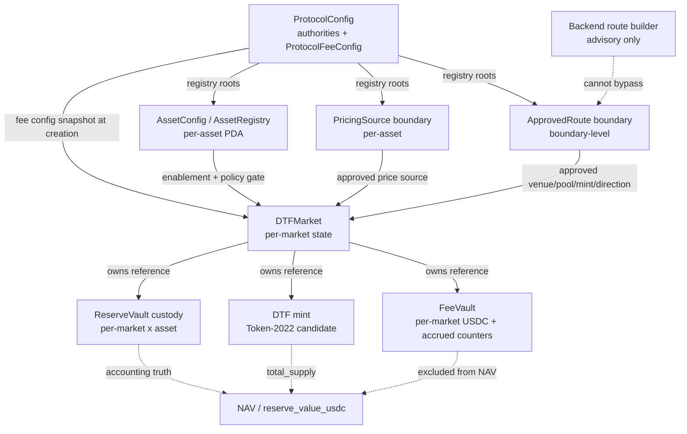

# Axis Core Account Model Proposal (P0-SPEC-04)

> ステータス: **proposal + minimal Rust scaffold source of truth**。本書は最終的な protocol behavior / serialization 仕様ではありません。account layout、field の bit 幅、instruction account ordering、PDA seed の最終形は engineering review 対象です（`requirements/19-axis-core-implementation-rfc.md` §11, §12）。
>
> 原則: Axis_docs requirements が canonical source of truth。既存 contract code・legacy docs と矛盾する場合は Axis_docs を優先。canonical な field を勝手に発明しない。未確定事項は「Unresolved review question」として明示的に残す。

---

## 1. Overview / 概要

Axis Core は次の reserve-backed DTF フローを実現する on-chain protocol layer です（`19` §15, `01` §8）。

```txt
USDC in
→ approved CPI execution
→ program-controlled reserve vault に実資産を保有
→ Token-2022 DTF token を mint（候補・要検証）
→ redeem で DTF を burn
→ reserve を unwind
→ USDC out
```

本提案は P0 の on-chain 状態カテゴリについて、「誰が何の状態を所有し、何を所有してはならないか」を accounting truth と authority 分離の観点から定義します。各カテゴリに owner / write authority / close authority / PDA derivation inputs / lifecycle / invariants / invalid states / unresolved を付与し、approval-ready な提案として整理します。

設計の核となる立場（Required design positions）:

- **Accounting truth は program が制御する実 reserve 残高のみ**。target weights / off-chain quotes / backend plans / UI data / indexer data / metadata はすべて advisory（`01` §7, `06` PRICE-001/PRICE-010, `19` Invariant 5/6/8/12）。
- **Reserve vault custody と fee custody は分離必須**。fee vault 残高は NAV から除外（`02` DTF-017, `13` FEE-016, `06` PRICE-001）。
- **Creator/protocol fee claim は reserve 残高を変えない**（`13` FEE-014/FEE-015, `02` DTF-017）。
- **Per-market USDC fee vault を v1 の preferred proposal とする**（engineering review が否定しない限り; `13` §9, §15）。
- **Market fee config は作成時 snapshot・作成後 immutable**（`02` DTF-014/DTF-015, `13` FEE-004/FEE-005, `09` ADMIN-008）。
- **creator は per-market で fee bps をカスタムできない**（`02` DTF-014, `13` FEE-004）。
- **DTFMarket は v1 で通常 close 不可。Deprecated status で運用**（本提案の position; close 権限は unresolved）。
- **`creator_fee_destination` は v1 immutable**。将来 governance update は out of scope。
- **AssetConfig は per-asset PDA としてモデル化**（提案）。
- **`AssetConfig` と `AssetExecutionPolicy` は P0 では 1 account に統合**（reviewer が異議を出さない限りの v1 default）。
- **`DTFMarket` weights は最大 5 assets の inline fixed-size array として保持**（reviewer が異議を出さない限りの v1 default）。
- **`ReserveVault` は dedicated PDA を preferred proposal とする**。
- **ApprovedRoute は本提案では boundary レベルのみ定義**し、route-validation の正確な layout は unresolved（`19` Q3）。
- **backend route builder は on-chain validation を迂回できない**（`19` Invariant 8, `05` EXEC-012）。

---

## 2. Scope / 対象範囲

本提案が対象とする P0 state categories（`19` §8 P0）:

- `ProtocolConfig`
- `DTFMarket`
- `DTF mint`
- `ReserveVault custody`
- `FeeVault / fee accounting boundary`
- `AssetConfig / AssetRegistry`（+ `AssetExecutionPolicy` / `AssetExecutionFlags`）
- `PricingSource boundary`（`PricingSourceRegistry` / `PricingSource`）
- `ApprovedRoute boundary`

本提案は account-model（状態所有・権限・lifecycle・invariant）の提案と、それを表現する最小限の Rust type / constant / seed-component / validation scaffold を対象とします。instruction surface 提案・CPI 実装・数式確定は別 spike / 別 spec の対象です。

---

## 3. Non-goals / 対象外

- protocol behavior の Rust 実装。今回含める Rust 変更は account/config scaffold のみ。
- 既存 requirement docs の変更。
- instruction account ordering / CPI 実装 / venue 固有実装の確定（`19` §11）。
- mint amount 計算式・redeem 会計式・NAV 計算法・rounding/dust 規則の確定（`19` §11, Q6）。
- Auction Program / ClearCorrection / Axis-controlled JIT liquidity / `AuctionRevenueVault`（P2; `19` Invariant 10, `01` §26-§28）。
- backend / database / frontend / indexer architecture（`19` §10。ただし account は indexer-friendly に設計; `19` §3）。
- 500-asset universe の最終格納方式（`01` §17。P0 は allowlist 概念のみ）。

---

## 4. Referenced documents / 参照ドキュメント

本提案で実際に使用した requirement documents:

- `requirements/02-dtf-market-requirements.md`（DTFMarket, reserve, fee state, status）
- `requirements/06-pricing-nav-requirements.md`（NAV, accounting truth, PricingSource）
- `requirements/07-execution-policy-risk-controls.md`（AssetExecutionPolicy/Flags, venue 承認）
- `requirements/08-asset-universe-requirements.md`（asset enablement, review-gated）
- `requirements/09-admin-safety-requirements.md`（authorities, fee admin, pause）
- `requirements/13-fee-model-requirements.md`（ProtocolFeeConfig, MarketFeeState, fee custody, claim）
- `requirements/19-axis-core-implementation-rfc.md`（P0 scope, product invariants, open questions）
- `requirements/01-definitions-and-decision-log.md`（canonical decisions: NAV, fee model, asset count, authorities, custody 分離, Open Version）
  - 注: 課題文では `requirements/01-open-version-requirements.md` を指していますが、当 repository に存在する該当ファイルは `requirements/01-definitions-and-decision-log.md` です（Open Version 定義は同ファイル §4 に含まれます）。canonical な存在しないファイル名を発明しないため、実ファイル名を記載します。
- `requirements/05-swap-cpi-execution-requirements.md`（ApprovedRoute / venue / route-validation の canonical ルール。`07` POLICY-012 がこれを canonical と参照）

補助的に参照（account 間相互作用の理解のため）:

- `requirements/03-mint-requirements.md`（mint flow の accounting truth 境界）
- `requirements/04-redeem-requirements.md`（redeem flow の actual USDC received）

---

## 5. Design principles / 設計原則

1. **Accounting truth は実 reserve 残高のみ**（`01` §7, `06` PRICE-001）。`reserve_value_usdc = Σ(reserve_balance_i × approved_price_i)`、`nav_per_dtf = reserve_value_usdc / total_supply`。
2. **advisory は accounting truth にしない**: target weights / quotes / backend plans / UI / indexer / metadata（`06` PRICE-010, `19` Invariant 5/6/8/12）。
3. **custody 分離**: `ReserveVault`（underlying）と `FeeVault`（USDC fee）は別 account（`02` DTF-017, `13` §9）。invariant `FeeVault != ReserveVault`。
4. **fee は backing でない**: accrued fee / fee vault 残高は NAV・reserve 価値・DTF backing から除外（`02` DTF-016/017, `13` FEE-016/017）。
5. **fee config の immutability**: market 作成時に protocol config から snapshot、作成後変更不可（`02` DTF-014/015, `13` FEE-004/005）。
6. **on-chain validation 優先**: backend は plan を作れても route / mint / balance delta / min_out の on-chain 検証を迂回できない（`19` Invariant 8, `05` EXEC-007/008/012/020）。
7. **review-gated enablement**: asset discovery は launch approval ではない（`08` §8.3, §8.8）。
8. **indexer-friendly**: account は将来の app/backend/indexer が読みやすい設計とするが、indexer は protocol truth ではない（`19` §3, Invariant 12）。
9. **Token-2022 は candidate**: DTF mint の Token-2022 採用は proposed default に留め、wallet / indexer / Orca / Raydium / mainnet-fork 検証が必要（`19` §6 "Validation Required"）。

---

## 6. Account relationship diagram / アカウント関係図



---

## 7. Account category summary table / カテゴリ要約表

| # | Account | 種別 | owner (program) | 主な所有状態 | accounting truth か |
|---|---|---|---|---|---|
| 1 | `ProtocolConfig` | singleton config PDA | Axis Core | 各 authority、`ProtocolFeeConfig`、各 registry の参照根 | No（設定値の真実） |
| 2 | `DTFMarket` | per-market state PDA | Axis Core | 構成資産・weights・status・creator・market fee snapshot・accrued counters | 一部 Yes（accrued fee counter は fee 会計の真実、reserve 価値ではない） |
| 3 | `DTF mint` | Token-2022 mint（候補） | SPL/Token-2022 program（mint authority = Axis Core PDA） | `total_supply` | Yes（NAV 分母） |
| 4 | `ReserveVault custody` | per-market×asset token account（PDA-owned） | SPL/Token-2022 program（authority = Axis Core PDA） | 各 underlying の実 reserve 残高 | **Yes（最上位）** |
| 5 | `FeeVault / fee accounting boundary` | per-market USDC vault（preferred）+ accrued counters | SPL program（authority = Axis Core PDA）+ counters in `DTFMarket` | claim 可能な creator/protocol fee | Yes（fee 会計の真実、NAV から除外） |
| 6 | `AssetConfig / AssetRegistry` | per-asset PDA（提案）+ policy/flags | Axis Core | 資産 enablement・policy preset・上限・pricing requirement | No（強制データ） |
| 7 | `PricingSource boundary` | per-asset pricing config | Axis Core | 承認 source 種別・freshness/deviation 閾値 | No（会計価格の取得元） |
| 8 | `ApprovedRoute boundary` | boundary-level（粒度 unresolved） | Axis Core | 承認 venue/pool/mint/direction/enable | No（実行許可の真実） |

補足: `MarketAssetWeight`（`02` §5）は #2 に inline か別 account かが unresolved（§8.2 参照）。

---

## 8. Detailed account model / アカウント別 詳細

### 8.1 ProtocolConfig

- **purpose**: protocol 全体の authority・fee config・各 registry の根を定義する singleton（`09` ADMIN-001, `13` §4）。
- **owner**: Axis Core。
- **write authority**: `authority`（fee config 更新、`09` ADMIN-008 / `13` §4）。pause 系は `pause_authority`。registry 更新は各 registry authority に委譲。
- **close authority**: なし（singleton は close 不可とする。upgrade/migration 手段は unresolved）。
- **PDA seed candidates**: `['protocol_config']`（singleton, bump 格納）。最終確定は engineering review（`19` §11）。
- **preferred proposal**: 単一 singleton account に authorities + `ProtocolFeeConfig` を集約し、asset/route/pricing の実体は各 per-entry account に分離（参照根のみ保持）。
- **alternative**: fee config を別 account（`ProtocolFeeConfig` 単独 PDA）に切り出す。
- **unresolved review question**: authority を single key か multisig か / `pause_authority` が global pause か market 単位か。
- **mutable fields**: 各 authority、`ProtocolFeeConfig`（将来 market 用のみ更新可、既存 market は不変; `13` §4）。
- **immutable fields**: なし（更新は caps と authority に拘束）。
- **lifecycle transition**: `InitializeProtocol`（生成）→ 運用中に authority/fee config 更新 → close なし。
- **invariants**: `mint_fee_bps <= max_mint_fee_bps`; `redeem_fee_bps <= max_redeem_fee_bps`; `creator_share_bps + protocol_share_bps == 10000`; `protocol_treasury` 有効（`13` FEE-011/012, `09` ADMIN-008）。
- **accounting impact**: 直接の reserve/NAV 影響なし。market 作成時の fee snapshot 元（`02` DTF-014）。
- **security impact**: 最重要の権限集約点。誤設定は全 market に波及。caps と share 合計検証が必須。
- **invalid states to reject**: cap 超過の fee bps; share 合計≠10000; 無効 `protocol_treasury`; 未認可者の更新。
- **unresolved fields/decisions**: authority キー形態 / upgrade 方針 / `pause_authority` のスコープ。

### 8.2 DTFMarket

- **purpose**: 1 つの取引可能 basket position を表す中核 state（`02` §1）。
- **owner**: Axis Core。
- **write authority**: 作成は creator（`CreateMarket`）だが fee/構成は protocol ルールで強制。status 変更は `pause_authority`（`09` ADMIN-006）。accrued counter は mint/redeem の program ロジックのみ更新（`13` FEE-013）。
- **close authority**: **v1 では通常 close 不可（本提案の position）**。市場停止は `Deprecated` status を使用（reserve/supply 残存中は close 禁止）。
- **PDA seed candidates**:
  - preferred proposal: `['market', creator, market_nonce]`。DTF mint も market から派生する可能性があるため、`dtf_mint` を market PDA seed にすると circular dependency が発生し得る。この案は creator ごとの nonce で market を先に一意化し、その market から DTF mint / vault を派生しやすい。
  - alternative: `['market', dtf_mint]`（market↔mint を 1:1 に固定できるが、DTF mint を market から派生する場合は circular dependency に注意）。
  - alternative: `['market', market_id]`（global counter / registry ベース）。
  - unresolved review question: 最終 seed choice は engineering review（`19` §11）。
- **mutable fields**: `status`（Created/Active/Paused/Deprecated; `02` DTF-012）、`accrued_creator_fee_usdc` / `accrued_protocol_fee_usdc`。
- **immutable fields**: `creator`（`13` FEE-002）、構成資産・target weights（v1 で rebalance は P0 外、weights 変更 instruction 未定義）、market fee snapshot 全項目（`mint_fee_bps`/`redeem_fee_bps`/`creator_share_bps`/`protocol_share_bps`; `02` DTF-015, `13` FEE-005）、`creator_fee_destination`（v1 immutable 推奨; `13` FEE-003）。
- **lifecycle transition**: `CreateMarket`（全検証 + fee snapshot）→ `Active` → `Paused`/Unpause → `Deprecated`（exit-only 等）。通常 close なし。
- **invariants**: weights は accounting に使わない（`01` §7）; accrued fee は reserve/NAV から除外（`02` DTF-016/017）; fee snapshot は immutable。
- **accounting impact**: NAV の構成参照（weights は advisory）。accrued counter は fee 会計の真実だが reserve 価値ではない。
- **security impact**: fee immutability を破ると creator による収奪が可能。weights を accounting に使うと over-mint リスク。
- **invalid states to reject**: 資産数 <2 / >5; 重複資産; `Σweight != 10000`; `weight < 100bps`; `weight > asset.max_weight_bps`; 未登録資産; `creation_enabled=false` 資産; pricing source 不在; route 要件未充足; creator のカスタム fee; 作成後 fee 変更（`02` DTF-001〜008/014/015, `07` POLICY-007）。
- **preferred proposal**: weights を `DTFMarket` 内の inline 固定長配列（最大 5）として保持（読み取り簡素・indexer-friendly）。
- **alternative**: `MarketAssetWeight` を per-(market,asset) 別 account（`['market_asset', market, asset_mint]`）として分離（拡張性重視）。
- **unresolved review question**: weights inline vs 別 account（`02` §5）; status enum の正準値・遷移; `Deprecated` 後の close 権限; `creator_fee_destination` の governance 更新ルール（`13` §15）。

### 8.3 DTF mint

- **purpose**: market ごとに一意の reserve-backed position token（`02` DTF-011, `19` §6）。
- **owner**: SPL/Token-2022 program が account owner、mint authority は Axis Core PDA（`02` DTF-011）。
- **write authority**: mint/burn は Axis Core のみ（mint/redeem 経路）。
- **close authority**: 通常 close しない（供給ゼロ時の扱いは unresolved）。
- **PDA seed candidates**: `['dtf_mint', market]`、mint authority PDA `['mint_authority', market]`。最終確定は engineering review。
- **preferred proposal**: **Token-2022 を proposed default / candidate とする**が、最終確定ではない。v1 conservative policy として metadata 系 extension のみ許容候補とし、transfer fee / transfer hook / permanent delegate / confidential transfer / interest-bearing / default frozen は v1 で回避（`19` §6）。
- **alternative**: legacy SPL Token mint（Token-2022 検証が不成立の場合のフォールバック候補）。
- **unresolved review question**: どの metadata extension を使うか（`19` Q1）; wallet/indexer/Orca/Raydium/mainnet-fork 互換（`19` §6 Validation Required）; mint amount 計算式（`19` Invariant 5, §11）。
- **mutable fields**: `supply`（mint/burn）。
- **immutable fields**: decimals、token program、採用 extension set（作成後固定）。
- **lifecycle transition**: market 作成時に create → mint（mint flow）/ burn（redeem flow）。
- **invariants**: `total_supply == 0` のとき `initial_nav = 1 USDC`（`06` PRICE-002, `01` §9）; mint は `actual_added_value_usdc / pre_trade_nav`（gross/quote では mint しない; `06` PRICE-012, `13` FEE-008）。
- **accounting impact**: `nav_per_dtf = reserve_value_usdc / total_dtf_supply`（`06` PRICE-001）。
- **security impact**: supply と reserve の整合崩壊は希薄化。危険 extension は v1 回避必須。
- **invalid states to reject**: 0 供給での除算（initial NAV で回避）; gross/quote ベース mint; 危険 extension 付き mint; market あたり複数 mint。
- **unresolved fields/decisions**: Token-2022 最終採否 / metadata extension / mint 計算式。

### 8.4 ReserveVault custody

- **purpose**: DTF を裏付ける各 underlying を program 管理 vault で保有（`02` DTF-010, `19` Invariant 3/4）。
- **owner**: SPL/Token-2022 program が token account owner、authority は Axis Core PDA（`02` DTF-010）。
- **write authority**: Axis Core の CPI 実行のみ（mint 時 compose / redeem 時 unwind）。
- **close authority**: 残高ゼロかつ market `Deprecated` 時に限定（dust 残時の扱いは unresolved; `19` Q6）。
- **PDA seed candidates**:
  - preferred proposal: 専用 PDA `['reserve', market, asset_mint]`（authority/owner を Axis Core PDA に固定しやすい）。
  - alternative: market authority PDA の ATA 派生（標準的だが authority モデルの明示性が下がる）。
  - unresolved review question: 専用 PDA か ATA か（`02` §5 "reserve account derivation", `19` §11）。
- **mutable fields**: 残高（CPI による実 delta のみ）。
- **immutable fields**: vault の mint（= asset mint と一致必須）、authority（Axis 制御）。
- **lifecycle transition**: market 作成時に各資産分 create/validate → mint で増加・redeem で減少 → `Deprecated`/exit-only で縮小 → 残高ゼロで close 候補。
- **invariants**: **これが accounting truth**。`asset_value_usdc_i = reserve_balance_i × approved_price_i`（`06` PRICE-001）; mint/redeem は pre/post の実 balance delta を真実とする（`05` EXEC-008, `06` PRICE-012/013）; all-or-nothing（`05` EXEC-020）。
- **accounting impact**: NAV・mint・redeem 会計の基礎。
- **security impact**: 誤 owner/authority、mint 不一致、quote 会計は資金喪失・希薄化に直結。
- **invalid states to reject**: vault mint ≠ asset mint; authority が Axis 制御でない; quote を accounting truth にする; balance delta が不正方向; accrued fee を reserve に算入; min_out 未達の部分成立（`02` DTF-010, `06` PRICE-001/012/013, `05` EXEC-007/008/020）。
- **unresolved fields/decisions**: 専用 PDA vs ATA; dust/rounding（`19` Q6）; decimals 正規化（`19` §11）。

### 8.5 FeeVault / fee accounting boundary

- **purpose**: creator/protocol の claim-based fee を reserve と分離して custody（`13` §9, `02` DTF-017）。
- **owner**: token account は SPL program owner、authority は Axis Core PDA。accrued counter は `DTFMarket` 内（または別 fee state account）。
- **write authority**: accrue は mint flow の program ロジック; claim/sweep は `ClaimCreatorFee`（creator_fee_destination / 定義 authority）・`ClaimProtocolFee`（protocol_treasury authority）（`13` FEE-014/015）。
- **close authority**: unresolved（per-market vault を `Deprecated` 後に close 可否）。
- **PDA seed candidates**:
  - preferred proposal: **per-market USDC fee vault** `['fee_vault', market]` + market 内 `accrued_creator_fee_usdc` / `accrued_protocol_fee_usdc` counter（`13` §9 推奨モデル, v1 preferred）。
  - alternative: shared protocol-level fee vault `['protocol_fee_vault']` + market 別 strict accounting（cross-market claim 誤り防止が必須; `13` §9）。
  - unresolved review question: per-market か shared+strict か（`13` §15, `19` Q7）; 正確な layout（`19` Q7）。
- **mutable fields**: fee vault 残高、accrued counters（accrue/claim）。
- **immutable fields**: vault の mint（USDC）。
- **lifecycle transition**: market 作成時に create/validate（`02` §4 "Create or validate USDC Fee Vault"）→ mint で accrue → claim/sweep で減少。
- **invariants**: `FeeVault != ReserveVault`（`13` §9）; fee は NAV・reserve 価値・DTF backing から除外（`02` DTF-016/017, `06` PRICE-001, `13` FEE-016/017）; **fee claim は reserve 残高を変えない**（`13` FEE-014/015）; double-claim 不可。
- **accounting impact**: NAV から完全除外。mint fee は reserve 合成前に控除（`net_usdc_for_composition = user_usdc_in − mint_fee_usdc`; `13` §6, FEE-007）。
- **security impact**: shared vault は cross-market claim 誤りリスク → market-level accounting 必須。double-claim 防止必須。
- **invalid states to reject**: fee vault = reserve account; fee を NAV/reserve に算入; double claim; 未認可 claim; claim による reserve 変動; redeem で fee 発生（v1 は `redeem_fee_bps=0`）（`13` FEE-009/014/015/016/017, `02` DTF-017）。
- **unresolved fields/decisions**: per-market vs shared（`13` §15, `19` Q7）; claim instruction 名・account 要件（`19` Q8）; creator/protocol claim を分離か統合か; protocol fee を per-market claim か複数 market sweep か; rounding（`13` §15, `19` Q6）; `creator_fee_destination` 可変性（`13` FEE-003, §15）。

### 8.6 AssetConfig / AssetRegistry（+ AssetExecutionPolicy / Flags）

- **purpose**: どの資産が reserve 資産として使用可能かを review-gated に定義し、per-asset 実行 policy を強制（`08` §8.1, `07` POLICY-002）。
- **owner**: Axis Core。
- **write authority**: `asset_registry_authority`（policy/flags 更新; `09` ADMIN-002/003）。
- **close authority**: 未規定。資産無効化は flags で行い、account 削除は非推奨（既存 DTF を自動削除しない; `02` DTF-008）。
- **PDA seed candidates**:
  - preferred proposal: **per-asset PDA** `['asset', asset_mint]`（本提案の position）。registry エントリ + `AssetExecutionPolicy` + `AssetExecutionFlags` を 1 account に統合。
  - alternative: registry エントリと policy を分離（`['asset', asset_mint]` + `['asset_policy', asset_mint]`）。`07` §5 と `08` §8 で表現が異なるため。
  - unresolved review question: 統合 vs 分離; on-chain に持つ support status の範囲（`08` §8.4 の多数 status のうちどれ）。
- **mutable fields**: flags（`creation_enabled`/`mint_enabled`/`redeem_enabled`/`rebalance_enabled`）、policy 上限値、support status / pricing tier（`09` ADMIN-002/003）。
- **immutable fields**: `asset_mint`、decimals/token program（確認済み canonical 値; `08` §8.8）、`hard_min_allocation_usdc = 1`（`07` POLICY-003, `01` §10）。
- **lifecycle transition**: discovery → `CANDIDATE_UNIVERSE`（全 flag false, pricing DISABLED）→ route/pricing/mint/risk review → 手動で launch-ready 昇格（`08` §8.3/§8.8）→ 緊急時 exit-only（`07` POLICY-011, `09` ADMIN-007）。
- **invariants**: discovery は自動 enable しない（`08` §8.3）; allocation 上限/下限を mint で強制（`07` POLICY-006）。
- **accounting impact**: 直接の reserve/NAV 影響なし。
- **security impact**: enablement 自動化は危険資産流入リスク → review-gated 必須。preset/override 優先順位ミスは過大エクスポージャ。
- **invalid states to reject**: 未登録 mint を market に使用; `creation_enabled=false` 資産で新規 DTF; discovery が自動 enable; `hard_min_allocation_usdc != 1`; preset 上限超過の weight/trade; manual_review_required 資産の自動承認（`02` DTF-007/008, `07` POLICY-003/006/007, `08` §8.3/§8.8）。
- **unresolved fields/decisions**: registry/policy 統合か分離か; support status の on-chain 表現範囲; 500-asset universe 格納（`01` §17）。

### 8.7 PricingSource boundary（PricingSourceRegistry / PricingSource）

- **purpose**: 各資産の承認された会計用価格取得元を定義し、UI 価格と accounting 価格を分離（`06` PRICE-003/004/010, `01` §16）。
- **owner**: Axis Core。
- **write authority**: `pricing_registry_authority`（追加/無効化/差し替え; `09` ADMIN-005）。
- **close authority**: 未規定（無効化は disable フラグ推奨）。
- **PDA seed candidates**: `['pricing', asset_mint]`（per asset）。複数 source 表現は unresolved。
- **preferred proposal**: per-asset の `PricingSource` に `PricingSourceType`（`ExternalOracle`/`DexTwap`/`DexSpot`/`StablePeg`/`LstExchangeRate`/`StockTokenOracle`）+ `max_staleness_slots` + deviation 閾値 + source 固有参照を保持。
- **alternative**: 1 資産に複数 source を持たせ優先順位/合成ルールを定義（doc 未規定のため unresolved）。
- **unresolved review question**: PricingSourceRegistry を P0 でどこまで実装するか（`19` Q2）; 固定小数点・rounding（`19` Q6）; 複数 source の優先・合成。
- **mutable fields**: source type、参照先、staleness/deviation 閾値、有効/無効（`09` ADMIN-005）。
- **immutable fields**: `asset_mint` 紐付け。
- **lifecycle transition**: 資産昇格時に pricing tier 割当（`08` §8.8）→ 運用中に stale/unsafe を差し替え（`09` ADMIN-005）→ 無効化で `DISABLED_UNTIL_PRICING_SOURCE`（`08` §8.3）。
- **invariants**: `approved_price_i` のみが会計価格; UI/indexer 価格は会計に使わない（`06` PRICE-010）; `deviation_bps <= max_pricing_deviation_bps`（`06` PRICE-011）。
- **accounting impact**: NAV・mint/redeem の価値計算の価格供給源（`06` PRICE-001/008/012）。
- **security impact**: stale/spoof 価格は希薄化・収奪に直結。freshness・depeg チェック必須。StockToken は spot-only 不可・manual review 必須（`06` PRICE-009）。
- **invalid states to reject**: source 不在で market 作成/mint; stale oracle/exchange rate; non-USDC stable の depeg 閾値なし or depeg 検出; StockToken の spot-only; deviation 超過; UI/indexer 価格を会計に使用（`06` PRICE-003/005/006/007/008/009/010/011）。
- **unresolved fields/decisions**: P0 実装範囲（`19` Q2）; rounding（`19` Q6）; 複数 source 表現。

### 8.8 ApprovedRoute boundary

- **purpose**: mint 合成 / redeem unwind の CPI 実行を、明示承認された venue/route のみに限定する protocol 状態（`05` EXEC-001/002/012, `19` Invariant 8）。
- **owner**: Axis Core。
- **write authority**: `route_registry_authority`（add/disable; `09` ADMIN-004）。
- **close authority**: 未規定（disable フラグ推奨）。
- **PDA seed candidates（粒度が unresolved）**: `['route', asset_mint, direction]` / `['route', input_mint, output_mint]` / `['route', venue, pool]`。
- **preferred proposal**: **本提案では boundary レベルのみ定義**する。ApprovedRoute は「承認 `VenueType`・venue program id・pool/venue account・input/output mint・`RouteDirection`・enable」を保持する protocol 状態であり、advisory metadata ではない（`05` EXEC-002〜005/012）。
- **alternative**: route-based / asset-pair-based / venue-based / pool-based のいずれか（`19` Q3）。
- **unresolved review question**: 粒度（route/asset-pair/venue/pool; `19` Q3）; controlled adapter と production venue CPI validation の境界（`19` Q4）; Orca/Raydium 検証スケジュール（`19` Q5）; adapter interface の最終形（`05` EXEC-019, `19` §11）。
- **mutable fields**: enable/disable、pool/venue account の更新（`09` ADMIN-004）。
- **immutable fields**: route に紐づく venue program id・direction の意味（変更は新規登録扱いが望ましい）。
- **lifecycle transition**: `INCLUDE_AFTER_ROUTE` / `ROUTE_REQUIRED` の資産に route validation → `RegisterApprovedRoute` → 運用中 `DisableApprovedRoute`（`08` §8.4, `09` ADMIN-004）。
- **invariants**: backend plan は on-chain validation を迂回不可（`19` Invariant 8, `05` EXEC-012）; route 複雑性制限（split / 任意 multi-hop / SOL 中継不可; `05` EXEC-011）; Jupiter/SDK quote で自動登録不可（`05` EXEC-012, `01` §15）。
- **accounting impact**: 直接の価値計算には入らないが、実行経路を縛り balance delta accounting の正当性を担保（`05` EXEC-008）。
- **security impact**: 未承認 venue/pool 実行は資金喪失リスク。
- **invalid states to reject**: route 不在/disable; 未承認 venue program id; pool/venue account 不一致; input/output mint 不一致; direction 不一致; split route; 未承認 multi-hop / SOL 中継; min_out 欠落/0（test 限定除く）; Jupiter/SDK quote で自動登録（`05` EXEC-001〜006/011/012）。
- **unresolved fields/decisions**: 粒度・validation layout（`19` Q3/Q4/Q5）。

---

## 9. Custody and accounting truth / カストディと会計真実

- **唯一の最上位 accounting truth は `ReserveVault` の実残高**（program 制御）。`reserve_value_usdc = Σ(reserve_balance_i × approved_price_i)`、`nav_per_dtf = reserve_value_usdc / total_supply`（`06` PRICE-001, `01` §7）。
- **advisory（accounting truth にしない）**: target weights / off-chain quotes / backend route plans / UI data / indexer data / metadata（`01` §7, `06` PRICE-010, `19` Invariant 5/6/8/12）。
- **mint/redeem は実 balance delta が真実**: mint は `actual_added_value_usdc / pre_trade_nav`、redeem は `actual_usdc_received`（`06` PRICE-012/013, `13` FEE-008, `05` EXEC-008）。
- **custody 分離（必須）**: `ReserveVault`（underlying）と `FeeVault`（USDC fee）は別 account（`02` DTF-017, `13` §9）。invariant `FeeVault != ReserveVault`。
- **fee は backing でない**: accrued creator/protocol fee と fee vault 残高は NAV・reserve 価値・DTF backing から除外（`02` DTF-016/017, `06` PRICE-001, `13` FEE-016/017）。
- **creator/protocol fee claim は reserve 残高を変えない**（`13` FEE-014/015）。
- **mint fee は合成前控除**: `net_usdc_for_composition = user_usdc_in − mint_fee_usdc`、reserve 合成は net のみ（`13` §6, FEE-007）。
- **3 種の区別**: (a) reserve-vault assets（backing・accounting truth）、(b) claimable fees（revenue・NAV から除外）、(c) advisory data（display/indexing。protocol truth でない）。
- **auction revenue（P2, 範囲外）**: `AuctionRevenueVault` 等で reserve/NAV から分離（`01` §28）。境界として記録のみ。

---

## 10. Authority separation / 権限分離

| 役割 | authority | signer 要件 / 主な write 対象 | source |
|---|---|---|---|
| プロトコル統括 | `authority` | signer; `ProtocolConfig`（fee config 含む, caps 内） | `09` ADMIN-001/008, `13` FEE-004 |
| 緊急停止 | `pause_authority` | signer; market status（pause/unpause）, 緊急 flag | `09` ADMIN-006/007, `02` DTF-012 |
| 資産レジストリ | `asset_registry_authority` | signer; AssetConfig/Policy/Flags | `09` ADMIN-002/003 |
| ルート | `route_registry_authority` | signer; ApprovedRoute add/disable | `09` ADMIN-004 |
| プライシング | `pricing_registry_authority` | signer; PricingSource add/disable/replace | `09` ADMIN-005 |
| プロトコル収益 | `protocol_treasury`（authority） | signer; ClaimProtocolFee/sweep | `13` FEE-015, §4 |
| creator fee 受取 | `creator_fee_destination`（market 固有） | signer; ClaimCreatorFee | `13` FEE-003/014 |

原則:

- **fee bps 変更権限は誰も持たない（market 作成後）**: market fee snapshot は immutable（`02` DTF-015, `13` FEE-005）。protocol fee config は将来 market 向けのみ更新可（`13` §4）。
- **creator は構成・weights を提出できるが fee をカスタムできない**（`02` DTF-014, `13` FEE-004）。
- **backend / route builder は authority を持たない**: plan 作成は可だが on-chain validation を迂回不可（`19` Invariant 8）。
- **mint/burn と fee accrue は program ロジックのみ**（外部 authority ではない）。
- **unresolved**: 各 authority が single key か multisig か、`authority` が他 registry authority を兼ねられるか。

---

## 11. Lifecycle and mutability / ライフサイクルと可変性

| Account | 生成 | 主な遷移 | close/廃止 | 主な immutable |
|---|---|---|---|---|
| `ProtocolConfig` | `InitializeProtocol` | authority/fee config 更新 | close なし | — |
| `DTFMarket` | `CreateMarket`（fee snapshot） | Created→Active→Paused⇄Active→Deprecated | **v1 close 不可。Deprecated 運用** | creator, weights, fee snapshot |
| `DTF mint` | market 作成時 | mint / burn | 通常 close しない | decimals, token program, extension set |
| `ReserveVault` | market 作成時（asset 毎） | 増加（mint）/減少（redeem） | 残高ゼロ+Deprecated 時のみ候補 | vault mint, authority |
| `FeeVault` | market 作成時 create/validate | accrue / claim・sweep | unresolved | vault mint（USDC） |
| `AssetConfig` | discovery 登録 | CANDIDATE→review→launch-ready→exit-only | flags 無効化（削除非推奨） | asset_mint, decimals, hard_min=1 |
| `PricingSource` | tier 割当 | 差し替え / 無効化 | disable 推奨 | asset_mint 紐付け |
| `ApprovedRoute` | `RegisterApprovedRoute` | enable / `DisableApprovedRoute` | disable 推奨 | venue program id, direction 意味 |

---

## 12. Invalid state review / 不正状態レビュー（カテゴリ毎に最低 1 件）

| Account | 拒否すべき invalid state（代表） | source IDs |
|---|---|---|
| `ProtocolConfig` | cap 超過 fee bps; share 合計≠10000; 無効 protocol_treasury; 未認可更新 | `13` FEE-011/012, `09` ADMIN-008 |
| `DTFMarket` | 資産数<2/>5; 重複資産; Σweight≠10000; weight<100/>max; 未登録/creation_disabled 資産; pricing 不在; route 未充足; creator カスタム fee; 作成後 fee 変更 | `02` DTF-001〜008/014/015, `07` POLICY-007 |
| `DTF mint` | 0 供給除算; gross/quote ベース mint; 危険 extension; market 複数 mint | `06` PRICE-002/012, `02` DTF-011, `19` §6 |
| `ReserveVault` | vault mint≠asset mint; 非 Axis authority; quote 会計; delta 不正方向; fee 混入; min_out 未達の部分成立 | `02` DTF-010, `06` PRICE-012/013, `05` EXEC-007/008/020 |
| `FeeVault` | FeeVault==ReserveVault; fee を NAV/reserve 算入; double claim; 未認可 claim; claim で reserve 変動; redeem fee 発生 | `13` FEE-009/014/015/016/017, `02` DTF-017 |
| `AssetConfig/Registry` | 未登録 mint 使用; creation_disabled で新規; discovery 自動 enable; hard_min≠1; preset 上限超過; manual_review 自動承認 | `02` DTF-007/008, `07` POLICY-003/006/007, `08` §8.3/§8.8 |
| `PricingSource` | source 不在; stale; depeg/閾値なし; StockToken spot-only; deviation 超過; UI 価格を会計使用 | `06` PRICE-003/005/006/007/008/009/010/011 |
| `ApprovedRoute` | route 不在/disable; 未承認 venue/pool; mint/direction 不一致; split/未承認 multi-hop/SOL 中継; min_out 欠落/0; quote 自動登録 | `05` EXEC-001〜006/011/012 |

---

## 13. Traceability table / トレーサビリティ表

| Account / Invariant | source requirement IDs |
|---|---|
| `ProtocolConfig`（authorities） | `09` ADMIN-001 |
| `ProtocolFeeConfig`（caps, share 合計, treasury） | `13` FEE-004/011/012, §4; `09` ADMIN-008 |
| `DTFMarket`（構成/weights/status） | `02` DTF-001〜012; `07` POLICY-007 |
| Market fee snapshot（derive & immutable） | `02` DTF-013/014/015; `13` FEE-002/003/004/005; `09` ADMIN-008 |
| Accrued fee counters | `02` DTF-016; `13` FEE-013 |
| `DTF mint`（一意・Axis authority・Token-2022 candidate） | `02` DTF-011; `19` §6 |
| NAV / initial NAV / 実 added value | `06` PRICE-001/002/012; `13` FEE-008; `01` §7/§9 |
| `ReserveVault` custody | `02` DTF-010; `19` Invariant 3/4; `06` PRICE-001 |
| 実 balance delta accounting | `05` EXEC-007/008; `06` PRICE-012/013 |
| custody 分離（reserve≠fee） | `02` DTF-017; `13` FEE-016, §9 |
| fee を NAV/backing から除外 | `02` DTF-016/017; `13` FEE-013/016/017; `06` PRICE-001 |
| fee claim は reserve を変えない | `13` FEE-014/015 |
| mint fee 合成前控除 | `13` FEE-006/007, §6 |
| redeem 無 fee + min_usdc_out | `13` FEE-009/010; `05` EXEC-006/007 |
| `AssetExecutionPolicy/Flags` | `07` POLICY-002/010; `01` §18 |
| asset enablement（review-gated） | `08` §8.3/§8.8; `02` DTF-007/008 |
| `PricingSource` registry / types / freshness | `06` PRICE-003/004/005/007/008/009/011; `01` §16; `09` ADMIN-005 |
| UI 価格と会計価格の分離 | `06` PRICE-010; `19` Invariant 12 |
| `ApprovedRoute`（protocol 状態・venue/pool/mint/direction） | `05` EXEC-001〜012; `07` POLICY-012; `09` ADMIN-004 |
| backend は validation 迂回不可 | `19` Invariant 8; `05` EXEC-012 |
| market TVL cap なし | `02` DTF-009; `07` POLICY-001; `01` §4 |
| all-or-nothing 実行 | `05` EXEC-020 |

---

## 14. Unresolved review questions / 未解決レビュー質問

### 14.1 Proposed v1 defaults unless reviewers object / レビュアー異議がなければ v1 採用する提案

以下は canonical final implementation ではありませんが、本 proposal では **v1 default として採用する提案** として扱います。Muse / Toby / engineering review が異議を出した場合のみ alternative に戻して再検討します。

- `FeeVault`: **per-market USDC FeeVault** を v1 default とする。shared protocol fee vault は alternative。
- `DTFMarket`: v1 では通常 close 不可。削除ではなく `Deprecated` status を使う。
- `creator_fee_destination`: v1 では immutable とする。将来 governance update は future spec。
- `AssetConfig`: per-asset PDA とする。
- `AssetConfig` / `AssetExecutionPolicy`: P0 では統合 account とする。分離は alternative。
- `DTFMarket` weights: 最大 5 assets の inline fixed-size array とする。`MarketAssetWeight` 別 account は alternative。
- `ReserveVault`: dedicated PDA を preferred/default とする。market authority ATA は alternative。

### 14.2 Still unresolved / 引き続き未解決

1. **Fee custody 形態（最重要; `13` §15, `19` Q7）**: proposed v1 default は per-market USDC fee vault。reviewer が shared protocol fee vault + strict market-level accounting を要求する場合、cross-market claim 防止の account 設計を追加で決める必要がある。
2. **ApprovedRoute 粒度（`19` Q3）**: route-based / asset-pair-based / venue-based / pool-based のどれを正準にするか。PDA seed と検証 layout に直結。
3. **PricingSourceRegistry の P0 範囲（`19` Q2）**: 全 6 source type を実装するか、controlled adapter 検証に必要な最小 set に絞るか。
4. **`creator_fee_destination` 可変性（`13` FEE-003, §15）**: proposed v1 default は immutable。reviewer が可変性を要求する場合、governance-approved update rule を future spec ではなく P0 に含めるか再判断する。
5. **DTFMarket weights 格納（`02` §5）**: proposed v1 default は inline fixed-size array（最大 5 assets）。`MarketAssetWeight` 別 account は alternative として残す。
6. **DTFMarket PDA seed**: preferred は `['market', creator, market_nonce]`（DTF mint を market から派生する際の circular dependency 回避）。`['market', dtf_mint]` は alternative として残す。最終 seed choice は engineering review（`19` §11）。
7. **DTFMarket close/deprecation**: proposed v1 default は通常 close 不可・`Deprecated` 運用。reviewer が close を要求する場合、`Deprecated` かつ残高ゼロ後の close authority と安全条件を別途定義する。
8. **status enum の正準値・遷移**: Created/Active/Paused/Deprecated を正準とし、各 instruction の許可状態（特に paused 時 redeem 可否; `02` DTF-012, `09` ADMIN-006）を確定したい。
9. **AssetConfig 分割（`07` §5 / `08` §8）**: proposed P0 default は registry+policy を 1 account に統合。分離は alternative。on-chain に持つ support status の範囲（`08` §8.4）は未解決。
10. **claim instruction 設計（`19` Q8, `13` §15）**: creator/protocol を分離 instruction か統合か、protocol fee を per-market claim か複数 market sweep か。
11. **固定小数点・rounding・dust（`19` Q6）**: NAV / supply / fee / reserve dust の表現と丸め方向。
12. **authority キー形態**: 各 authority（特に `authority` と `pause_authority`）を single key か multisig か、兼任可否。
13. **Token-2022 最終採否（`19` §6, Q1）**: DTF mint の Token-2022 を proposed default のまま wallet/indexer/Orca/Raydium/mainnet-fork 検証で確定する。どの metadata extension を採用するか。
14. **ReserveVault 派生（`02` §5, `19` §11）**: proposed v1 default は dedicated PDA。market authority の ATA は alternative。最終 derivation は engineering review。
15. **close authority 方針（全 account）**: deprecated market / 残高ゼロ reserve / fee vault / DTF mint の close を許可するか恒久保持か。

---

## 15. Minimal Rust scaffold mapping / 最小 Rust scaffold 対応

Rust scaffold は `programs/axis-core/src/` に置き、本 proposal を source of truth とします。

| Proposal boundary | Rust scaffold |
|---|---|
| protocol constants / PDA namespaces | `constants.rs` |
| invalid account-model states | `error.rs` |
| `ProtocolConfig` / `ProtocolFeeConfig` | `state/protocol_config.rs` |
| `DTFMarket` / `MarketStatus` / inline weights | `state/dtf_market.rs` |
| merged per-asset `AssetConfig` / execution policy / flags | `state/asset_config.rs` |
| unresolved pricing boundary | `state/pricing_source.rs` |
| unresolved route boundary | `state/approved_route.rs` |
| candidate/preferred seed components | `state/pda.rs` |

Scaffold に適用する境界:

- account serialization、discriminator、reserved bytes、account size、zero-copy layout は定義しない。
- instruction handler、account-meta ordering、CPI、mint/redeem、fee claim、NAV、rounding/dust は実装しない。
- `ApprovedRoute` は generic な venue program/account、input/output mint、direction の boundary 表現に留め、production DEX 固有 remaining accounts、adapter interface、PDA granularity を確定しない。
- `PricingSource` は conceptual type と共通 policy fields の boundary 表現に留め、P0 subset と source 固有 account references を確定しない。
- DTF mint seed namespace は token program を選択しない。Token-2022 は validation 完了まで proposed default / candidate のまま。
- seed helper は candidate/preferred seed component を返すだけとし、最終 PDA derivation/validation contract を確定しない。
- `ReserveVault` と per-market USDC `FeeVault` は別 namespace とし、同一 custody account を基本 invalid state として表現する。
- target weights と fee counters を reserve balance/NAV の代替として使用する field や helper は追加しない。

---

_本提案は account-model と最小 Rust scaffold の source of truth です。canonical 値は Axis_docs requirement ID に紐付け、未確定事項は review question または code TODO として明示します。_
